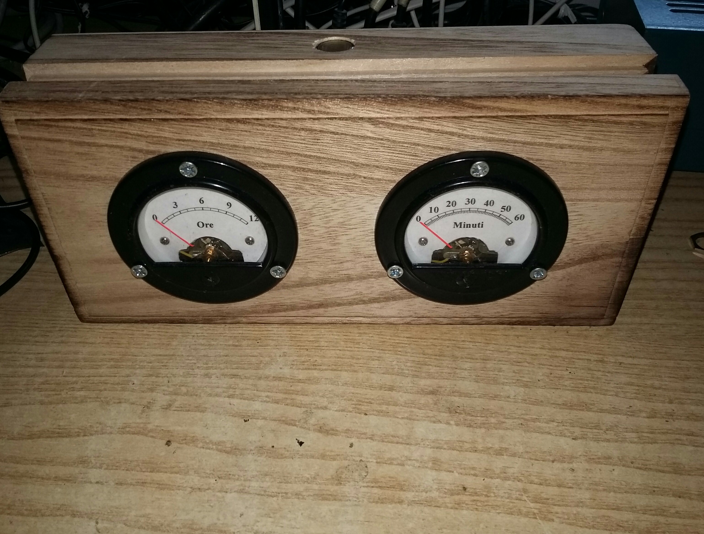
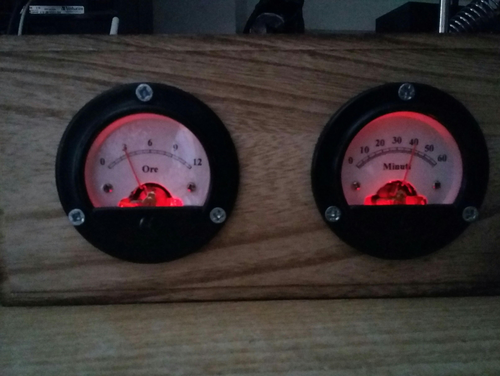
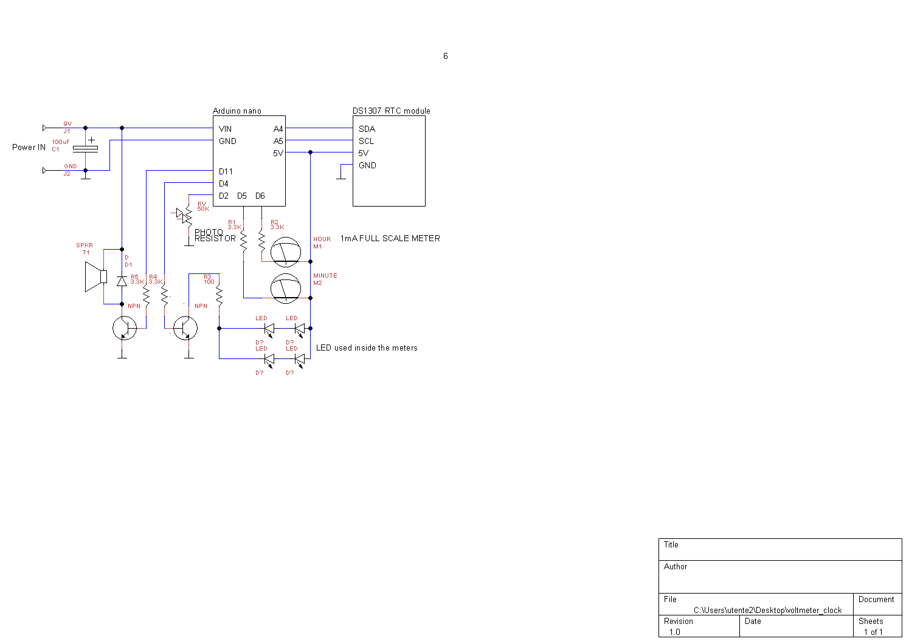

# VOLTMETER_CLOCK
How to turn a couple of amperometer in a clock

1 Arduino NANO
1 DS1307 RTC module
2 1mA amperometer(analog)
1 photoresistor

The most difficult part is to draw the clock quadrants. I've used a software that does exactly this job. Look for GALVA at http://www.f5bu.fr/galva-download/.

The photoresistor is used to detect the dark and to trasmit data to the arduino, maybe to calibrate, or set the time or the alarm.

